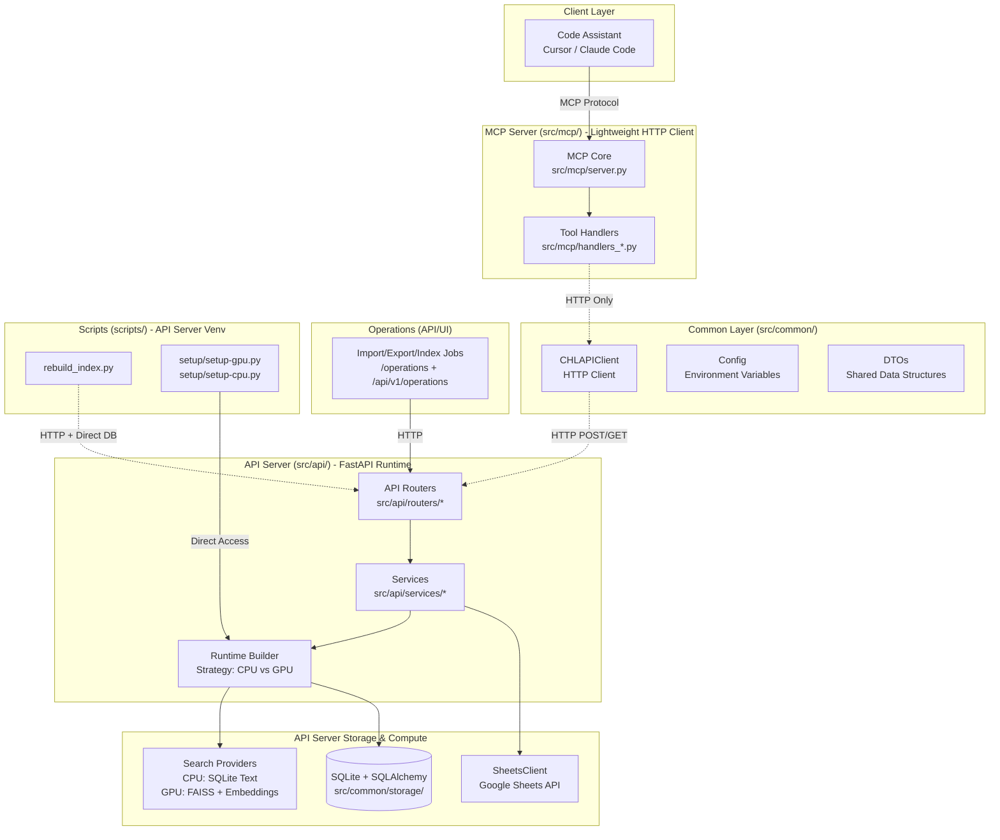
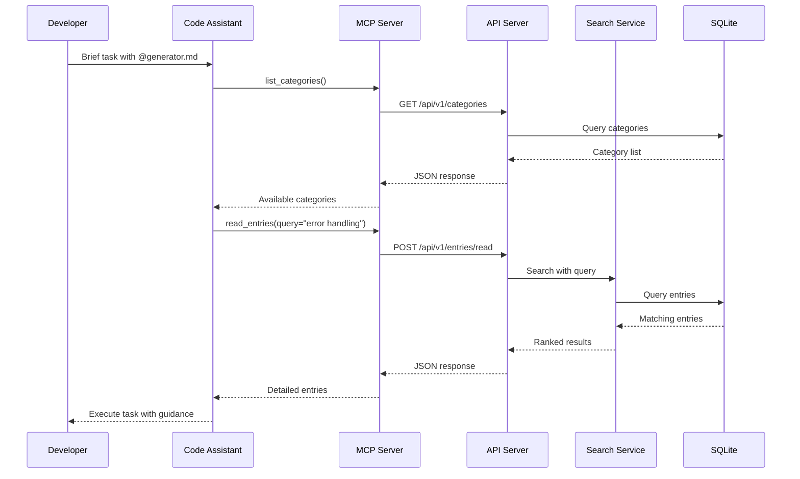
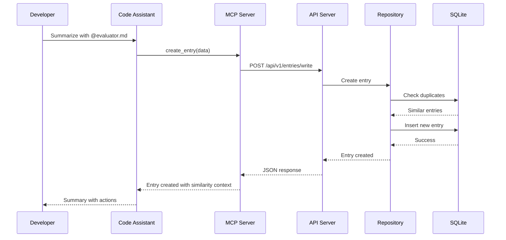
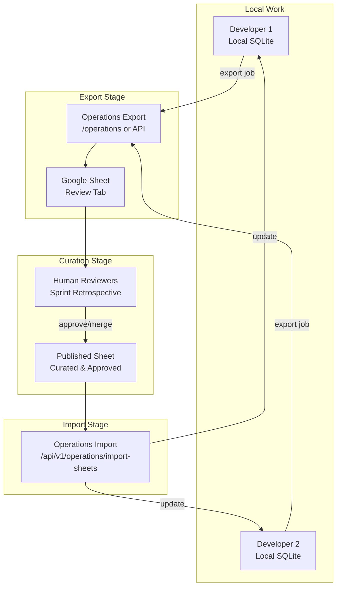

# CHL System Architecture

## 1. Overview

This document describes the technical architecture of the Curated Heuristic Loop (CHL) system. The system is designed around a **two-tier HTTP-based architecture** with clear separation between the API server (data & compute) and the MCP server (protocol adapter).

For curation architecture and flow, see [curation_spec.md](./curation_spec.md).

### 1.1. High-Level Diagram

**Key Architectural Principles:**

1. **HTTP-Only Communication**: MCP server communicates with API server exclusively via HTTP
2. **Two-Tier Deployment**: API server (platform-specific venv) + MCP server (uv sync)
3. **CPU/GPU Separation**: Strategy pattern for runtime modes, fixed at startup
4. **Local-Only Deployment**: No authentication, simple error handling. NO CLOUD DEPLOYMENT. 

## 2. System Components

### 2.1. API Server (`src/api/`)

The FastAPI server is the sole authority for all data persistence, search operations, and background workers.

**Responsibilities:**

- SQLite database operations (CRUD, transactions)
- Vector search (FAISS) and text search (SQLite LIKE)
- Background embedding worker (GPU mode only)
- Google Sheets integration (import/export)
- Web dashboards (Settings, Operations)
- REST API for MCP and scripts

**Runtime Backends:**

- **CPU Mode** (`backend="cpu"`): SQLite text search only, no ML dependencies
- **GPU Modes** (`backend="metal"/"cuda"/"rocm"`): FAISS vector search with embeddings and reranking

Backend is automatically detected from `data/runtime_config.json` (created by `scripts/setup/check_api_env.py`). To switch backends, re-run diagnostics and restart the server.

**Key Modules:**

- `src/api/routers/` - FastAPI route handlers
- `src/api/services/` - Business logic (operations, settings, telemetry, workers)
- `src/api/cpu/` - CPU-specific runtime and search provider
- `src/api/gpu/` - GPU-specific runtime, FAISS manager, embedding/reranker clients
- `src/api/runtime_builder.py` - Strategy factory for CPU/GPU mode selection

### 2.2. MCP Server (`src/mcp/`)

The lightweight MCP server exposes CHL functionality to AI assistants via the Model Context Protocol. It is a **pure HTTP client** with no direct database or FAISS access.

**Responsibilities:**

- Handle MCP tool calls from AI assistants
- Translate tool calls to API server HTTP requests
- Return formatted responses to AI assistants

**Architecture Constraint:**

- MCP server may ONLY import from:
  - `src.common.config.*` (environment configuration)
  - `src.common.api_client.*` (CHLAPIClient HTTP wrapper)
  - `src.common.dto.*` (shared data structures)
- All other operations must go through API server HTTP endpoints

**Key Modules:**

- `src/mcp/server.py` - MCP protocol server (FastMCP)
- `src/mcp/handlers_entries.py` - Entry operations (read, write, update)
- `src/mcp/handlers_guidelines.py` - Guidelines operations
- `src/mcp/core.py` - Shared runtime (API client, categories cache)

### 2.3. Common Layer (`src/common/`)

Shared utilities used by both API and MCP servers.

**Modules:**

- `src/common/config/` - Environment variable configuration
- `src/common/api_client/` - CHLAPIClient HTTP wrapper
- `src/common/dto/` - Shared data structures for validation
- `src/common/storage/` - Database, schema, repository (API server only)
- `src/common/web_utils/` - Static files, templates, markdown rendering (API server only)

**Import Rules (enforced by boundary tests):**

- MCP server: May import only `config`, `api_client`, `dto`
- API server: May import all `src/common.*` modules
- Scripts: May import `config`, `api_client`, `storage` (but run in API venv)

### 2.4. Operational Interfaces

Prefer the API server for import/export/index operations; remaining scripts focus on setup and maintenance, and they all run from the **API server's venv** (not via `uv run`).

**API/UI jobs:**

- Import from Google Sheets via `/operations` or `POST /api/v1/operations/import-sheets` (destructive; uses configured credentials/IDs)
- Export the database snapshot via `/operations` (Google Sheets spreadsheet export) or the API export endpoints (`/api/v1/entries/export-csv`, `/api/v1/entries/export-excel`, `/api/v1/entries/export-excel-download`)
- Rebuild index, refresh embeddings, and sync guidelines via `/operations` (jobs: `rebuild-index`, `sync-embeddings`, `guidelines`)

**Maintenance scripts (HTTP orchestration):**

- `rebuild_index.py` - Rebuild FAISS index (GPU) or refresh text search data (CPU)
- `sync_embeddings.py` - Sync embeddings for all entries (GPU mode)
- `scripts/ops/search_health.py` - Check search system health (falls back to direct DB/FAISS inspection only if the API is unreachable)
- `seed_default_content.py` - Load starter content

**Setup Scripts (exception to HTTP-first rule):**

- `setup/setup-gpu.py` - Download models, initialize GPU environment (direct API imports)
- `setup/setup-cpu.py` - Initialize database schema (direct DB access)
- `smoke_test_cuda.py` - Test NVIDIA CUDA GPU components (direct API imports)

## 3. Data Flow Patterns

### 3.1. Generator Mode (Read Path)

### 3.2. Evaluator Mode (Write Path)

### 3.3. Curation Workflow (Export/Import)

## 4. Data Models and Storage

The system utilizes three primary data surfaces: local SQLite, a local FAISS index, local embedding and reranking (GPU mode only), and remote Google Sheets.

### 4.1. Local SQLite

The authoritative per-user store. Contains tables for:

- `experiences` - Atomic patterns and heuristics
  - Fields: `id`, `category_code`, `section`, `title`, `playbook`, `context`
  - Provenance: `source`, `sync_status`, `author`
  - Timestamps: `created_at`, `updated_at`, `synced_at`

- `category_skills` - Long-form context and domain knowledge
  - Fields: `id`, `category_code`, `name`, `description`, `content`
  - Additional fields: `license`, `compatibility`, `metadata`, `allowed_tools`, `model`
  - Provenance: `source`, `sync_status`, `author`
  - Timestamps: `created_at`, `updated_at`, `synced_at`, `exported_at`

- `embeddings` - Vector representations for search (GPU mode only)
  - Links to experiences/skills via `entity_id` and `entity_type`
  - Stores serialized vectors and embedding model version

- `categories` - Metadata for each knowledge category
  - Fields: `code`, `name`, `description`

### 4.2. Local FAISS Index (GPU Mode Only)

Performance layer for efficient vector search. Index is keyed by `experience_id` and `skill_id` and is updated through operator-driven workflows (web UI or `rebuild_index.py`).

**Mode-Specific Behavior:**
- **CPU Mode**: No FAISS index, search uses SQLite `LIKE` queries
- **GPU Mode**: FAISS index backed by embeddings table, with optional reranking

### 4.3. Google Sheets

Human-readable surface for team-based curation. The Operations export job generates a **Review Sheet** from local databases, and curators merge approved content into a **Published Sheet**, which is then consumed by the Import operation to update local databases across the team.

## 5. Key Architectural Decisions

### 5.1. HTTP-Based API ↔ MCP Communication

**Decision**: Use HTTP/REST API as the sole communication method between MCP server and API server.

**Rationale:**

- **Multi-client concurrency**: Enables running multiple MCP instances (e.g., Claude Code, Cursor, multiple terminal sessions) on the same machine simultaneously
- **Shared FAISS consistency**: Centralizing FAISS index in the API server ensures all MCP clients query the same index. Without this architecture, each MCP instance would maintain its own FAISS database, leading to data inconsistency and wasted resources
- **Single source of truth**: API server is the sole authority for database and FAISS operations, preventing state divergence across clients
- **Resource control**: API server lock mechanisms coordinate concurrent access (index rebuilds, embedding updates)
- **Process isolation**: Prevents resource conflicts when multiple code assistants access CHL simultaneously
- **Clear error boundaries**: HTTP layer provides well-defined failure modes

**Implications:**

- All MCP operations go through API endpoints
- API server maintains single FAISS index shared by all clients
- `CHLAPIClient` is the only shared client library
- Lock mechanisms prevent concurrent modification issues
- Multiple developers or multiple IDE sessions can safely use CHL on the same machine

### 5.2. CPU/GPU Runtime Separation

**Decision**: Separate CPU-only and GPU-accelerated implementations into distinct modules (`src/api/cpu/` and `src/api/gpu/`) using strategy pattern.

**Rationale:**

- Clear separation makes code easier to understand
- CPU mode has no GPU dependencies (lighter installations)
- Independent testing without mocking
- Better developer onboarding

**Implications:**

- Mode is fixed at startup (no runtime switching)
- Switching modes requires data cleanup and re-setup
- Runtime builder provides abstraction layer

### 5.3. Directory Structure for Clarity

**Decision**: Three-tier directory structure `src/api/`, `src/mcp/`, `src/common/` with explicit boundaries.

**Import Rules:**

- Common code has no dependencies on API or MCP
- API server may import any `src/common.*` modules
- MCP server may import only `src.common.{config,api_client,dto}`
- API and MCP communicate only via HTTP
- Setup scripts (`scripts/setup/setup-gpu.py`, `smoke_test_cuda.py`) are exceptions

**Enforcement:**
- Boundary tests enforce these rules via AST parsing (`tests/architecture/test_boundaries.py`)

### 5.4. Local-Only Deployment

**Decision**: Design for local-only deployment where MCP and API server run on the same developer machine.

**Rationale:**

- MVP stage, not building cloud service yet
- Simplicity without authentication/authorization complexity
- Fast iteration with minimal deployment overhead

**Implications:**

- No authentication layer required
- Simple error handling (`CHLAPIClient` raises standard HTTP exceptions)
- MCP receives API URL as start parameter (typically `localhost:8000`)
- Lock mechanisms sufficient for concurrency (no distributed locks)

### 5.5. Fixed Runtime Mode

**Decision**: Runtime mode (CPU vs GPU) is fixed at API server startup and cannot be changed at runtime.

**Rationale:**
- Simplicity eliminates complex mode-switching logic
- GPU resources (FAISS index, embeddings) are expensive to load/unload
- Clear expectations for users
- Data consistency (avoids partially-synced embeddings)

**Implications:**

- Backend determined from `data/runtime_config.json` at startup
- Backend change requires: re-run `scripts/setup/check_api_env.py` → restart server → rebuild index
- Template selection happens once at startup
- No hot-swapping between CPU and GPU providers
- No automatic fallback from GPU to CPU mode

## 6. Interfaces and APIs

### 6.1. MCP Interface

The MCP server provides a simple, tool-based interface for AI assistants:

**Available Tools:**

- `list_categories()` - List all available category shelves
- `read_entries(entity_type, category_code, query/ids)` - Fetch experiences or skills
- `create_entry(entity_type, category_code, data)` - Create new entry
- `update_entry(entity_type, category_code, entry_id, updates)` - Update existing entry
- `get_guidelines(guide_type)` - Return generator or evaluator workflow guide

**Key Behaviors:**

- Reads via vector search (FAISS) in GPU mode, text search in CPU mode
- Writes persist to SQLite immediately with `embedding_status='pending'`
- No direct Sheet access - all curation flows through explicit export/import scripts
- Responses include provenance metadata (`source`) to distinguish global vs. personal entries

### 6.2. REST API

The FastAPI server exposes a REST API for programmatic control and monitoring:

**Core Endpoints:**
- `/health` - Health checks for server and components
- `/api/v1/categories` - List categories
- `/api/v1/entries/read` - Read entries with search
- `/api/v1/entries/write` - Create entry
- `/api/v1/entries/update` - Update entry
- `/api/v1/entries/export-csv` - Export entries as CSV (zip archive)
- `/api/v1/entries/export-excel` - Export entries as Excel
- `/api/v1/entries/export-excel-download` - Download Excel export
- `/api/v1/operations/{job_type}` - Trigger operations jobs
- `/api/v1/operations/jobs/{job_id}` - Get job status
- `/api/v1/settings` - Manage application settings
- `/api/v1/workers/*` - Control background workers (GPU mode)

**Web Dashboards:**
- `/settings` - Configuration, diagnostics, backup/restore
- `/operations` - Import/export/index triggers, job history

## 7. Configuration Management

Configuration is managed by `src/common/config/config.py`, which loads settings from environment variables with sensible project defaults.

**Key Environment Variables:**
- `CHL_EXPERIENCE_ROOT` - Base path for database, FAISS index, and data files
- `CHL_API_BASE_URL` - API server URL for MCP and scripts (default: `http://localhost:8000`)
- `GOOGLE_CREDENTIAL_PATH` - Path to Google service account JSON
- `IMPORT_SPREADSHEET_ID` - Published spreadsheet ID for imports
- `EXPORT_SPREADSHEET_ID` - Review spreadsheet ID for exports

**Note:** Backend selection (cpu/metal/cuda/rocm) is automatically determined from `data/runtime_config.json` - no environment variable needed.

## 8. Technology Stack

### 8.1. API Server Runtime

**Core Dependencies:**
- Storage: SQLite with SQLAlchemy ORM
- Search (GPU mode): FAISS (`faiss-cpu`) for vector search
- Embeddings/Reranking (GPU mode): Qwen3 GGUF models via `llama-cpp-python`
- External Services: `gspread` and `google-auth` for Google Sheets
- Web Framework: FastAPI with Uvicorn

### 8.2. MCP Server Runtime

**Minimal Dependencies:**
- MCP Protocol: `fastmcp>=0.3.0`
- HTTP Client: `httpx>=0.27.0`, `requests>=2.31.0`
- Configuration: `python-dotenv>=1.0.0`, `pyyaml>=6.0`

**No ML dependencies** - all heavy lifting happens in the API server.

## 9. Deployment Architecture

### 9.1. Two-Tier Deployment Model

**Tier 1: API Server (Platform-Specific Venv)**\nSee `README.md` and `doc/install_env.md` for platform-specific setup.\n\n**Tier 2: MCP Server (UV Managed)**\nSee `README.md` for MCP setup and client configuration.\n\n**Scripts** run from the API server venv (see `doc/manual.md` for details).

### 9.2. Concurrency Model

**Multi-Client Support:**
- Users may run multiple MCP clients simultaneously (e.g., Cursor and Claude Code)
- API server provides single point of control with lock mechanisms
- Background worker coordination uses in-process mechanisms (no distributed locks)

**Lock Mechanisms:**
- FAISS file operations: Lock during rebuild/snapshot operations
- Background worker coordination: Pause/drain/resume controls
- SQLite transactions: WAL mode with retry logic for transient locks
