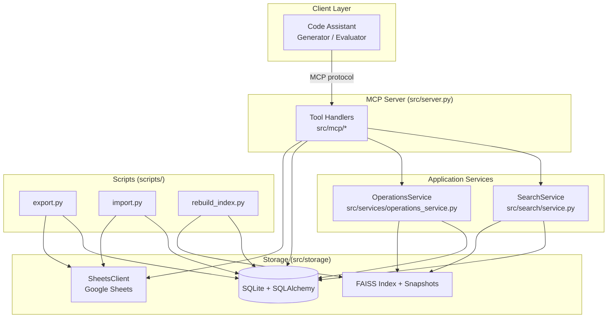
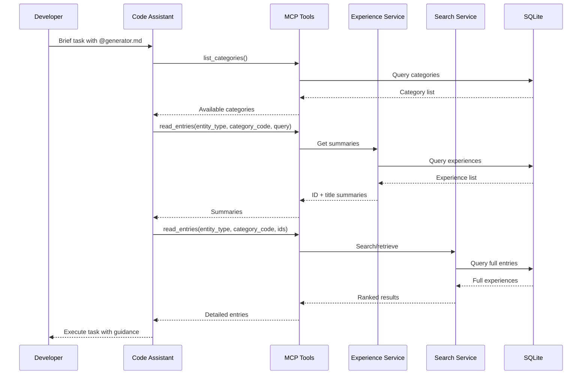
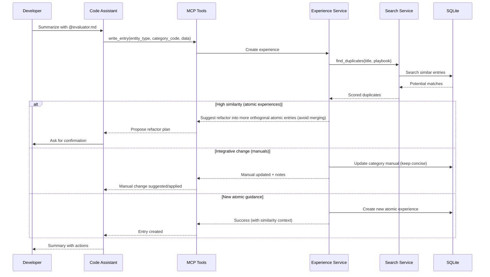
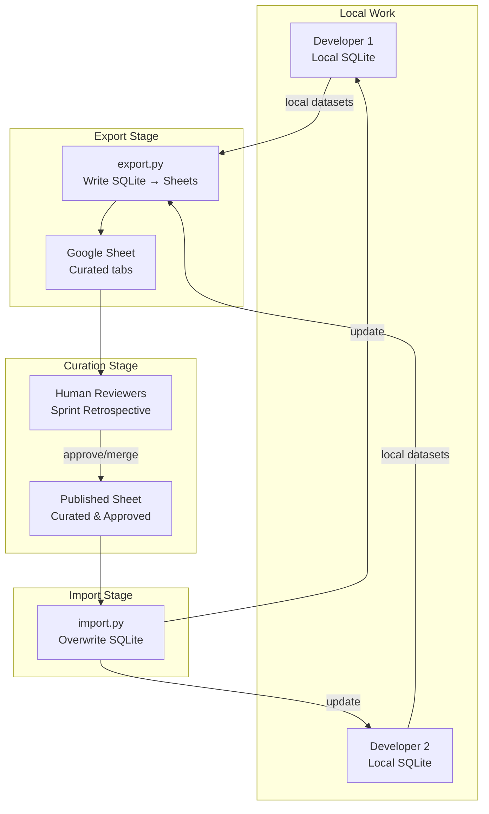

# CHL System Architecture

## Overview

This document describes the architecture of the Curated Heuristic Loop (CHL) system. The system uses SQLite database storage with optional vector search capabilities, while maintaining the core Generator/Evaluator workflow and providing team collaboration features through Google Sheets integration.

## High-Level Architecture

## Data Flow Patterns

### Generator Mode (Read Path)

### Evaluator Mode (Write Path with Dedup)

### Export/Sync Workflow (Team Collaboration)

## Key Architectural Decisions

### 1. Search Abstraction Layer

Provider-based architecture allows swapping search implementations without changing the service layer.

**Interface Contract:**
- `search(query, category_code, top_k)` - Find experiences matching query text
- `find_duplicates(title, playbook, category_code, threshold)` - Detect similar entries before insert
- `rebuild_index()` - Reconstruct search index from database

**Implementations:**
- SQLite text provider using simple substring and exact-title matching (fallback)
- Vector provider backed by FAISS with optional reranking scores from the Qwen3 GGUF reranker (served via `llama-cpp-python`)

### 2. Knowledge Organization: Two Data Types

The CHL system organizes knowledge into two complementary data types:

#### Atomic Experiences
**Purpose**: Capture specific, focused patterns and heuristics that solve discrete problems.

**Characteristics**:
- **Focused**: Each experience addresses one specific pattern or approach
- **Orthogonal**: Experiences should have low relevance to each other
- **Actionable**: Contains concrete playbook steps
- **Structured**: Has sections (useful/harmful/contextual) with optional context
- **Anti-bloat**: When duplicates detected, refactor both experiences to be more atomic rather than merging

**Use Cases**:
- "Always validate user permissions before database mutations"
- "Use DB transactions for multi-step data changes"
- "Avoid N+1 queries in Laravel by eager loading relationships"

**Storage**: `experiences` table with 120-char title, 2000-char playbook

#### Category Manuals
**Purpose**: Store broader context, tutorials, and domain knowledge that doesn't fit into atomic experiences.

**Characteristics**:
- **Long-form**: No length limit on content
- **Contextual**: Provides background, explanations, and domain knowledge
- **Tutorial-style**: Can include step-by-step guides, architecture overviews
- **Complementary**: Works alongside atomic experiences to provide full picture

**Use Cases**:
- Laravel authentication architecture overview
- Database migration best practices and common patterns
- Frontend component organization philosophy
- Testing strategy and pyramid explanation

**Storage**: `category_manuals` table with 120-char title, unlimited content, optional summary

**IDs**: `MNL-<CATEGORY_CODE>-YYYYMMDD-HHMMSSmmm` (e.g., `MNL-FTH-20250115-104200123`)

**Workflow Integration**:
- LLM retrieves **manuals** during work sessions for broader context
- LLM retrieves **experiences** for specific, actionable patterns
- After session, LLM creates/updates **manuals** to capture conversation context
- LLM creates **experiences** only when specific, atomic patterns emerge

### Decision Guidelines: Experience vs Manual

- Use an **atomic experience** when guidance is focused, actionable, and testable on its own.
- Use a **manual update** when the change is integrative background, architecture rationale, or synthesis across multiple experiences.
- Keep manuals concise to preserve embedding/search quality; avoid dumping global atomic heuristics into manuals.
- On high similarity among experiences, prefer refactoring into more orthogonal entries instead of merging into broader ones.

### 3. SQLite Schema Design

**experiences** - Atomic patterns and heuristics
- Primary fields: id, category_code, section, title, playbook, context
- Provenance: source (local/global), sync_status (synced/pending/local_only), author
- Timestamps: created_at, updated_at, synced_at

**category_manuals** - Long-form context and domain knowledge
- Primary fields: id, category_code, title, content, summary
- Provenance: source (local/global), sync_status (synced/pending/local_only), author
- Timestamps: created_at, updated_at, synced_at

**embeddings** - Vector representations for search
- Links to experiences and manuals via entity_id and entity_type
- Stores serialized vectors
- Tracks embedding model version

**categories** - Category metadata
- Three-letter code + human-readable name

### 4. Provenance & State Management

**Source Field:**
- `local` - Created by individual developer, not yet reviewed
- `global` - Synced from published sheet, team-approved

**Sync Status States:**
- `synced` (0) - Local copy matches the latest published sheet after `chl sync` completes
- `pending` (1) - Needs human review (new local entry or modified global entry)
- `local_only` (2) - Personal preference, keep local only, exclude from exports

**State Transitions:**
- New local entry: `source='local', sync_status='pending'`
- Update global entry: `source='global', sync_status='pending'`
- After export: keep `sync_status='pending'` until published entries are imported
- Personal item: `sync_status='local_only'`
- After sync: `source='global', sync_status='synced'` and update `synced_at`

Whenever entries move to `synced`, record the current UTC timestamp in `synced_at` for traceability.

### 5. Duplicate Detection Strategy

**Philosophy: Atomic Experiences, Not Merging**

Duplicate detection is used to maintain a library of atomic, focused experiences:
- **Goal**: Prevent experience bloat and overlap
- **Approach**: When high similarity is detected, guide the LLM to refactor both the existing and new experiences to be more focused and orthogonal
- **Anti-pattern**: Avoid merging or updating experiences into broader, less specific entries

**Detection Thresholds**:
- `duplicate_threshold_update (0.85)`: High similarity - prompt LLM to refactor both experiences into atomic, orthogonal entries
- `duplicate_threshold_insert (0.60)`: Medium similarity - surface context to help LLM differentiate and maintain focus

**Workflow**:
- Detect similar experiences during write operations
- Present similarity scores and existing entries to the LLM
- Let the LLM decide how to refactor for atomicity
- Curator reviews ensure experiences remain focused and non-overlapping

### 6. Configuration Management

Configuration is loaded by `src/config.Config`, which reads environment variables directly and falls back to project defaults (database under `<experience_root>/chl.db`, FAISS index under `<experience_root>/faiss_index`, etc.). The helper also auto-creates the experience root directory when required, and resolves relative paths under `<experience_root>`.

**Configuration highlights:**
- Database path (`CHL_DATABASE_PATH`) and echo flag
- Experience root (`CHL_EXPERIENCE_ROOT`) which drives default paths for SQLite, FAISS, and model selection cache
- Duplicate detection thresholds (`CHL_DUPLICATE_THRESHOLD_INSERT`, `CHL_DUPLICATE_THRESHOLD_UPDATE`)
- Read limits for MCP tools (`CHL_READ_DETAILS_LIMIT`, used by read_entries)
- ML model overrides (`CHL_EMBEDDING_REPO`, `CHL_EMBEDDING_QUANT`, `CHL_RERANKER_REPO`, `CHL_RERANKER_QUANT`)
- Export & sync settings (Google credentials path, review/published sheet IDs)
- Logging level (`CHL_LOG_LEVEL`) and optional author override (`CHL_AUTHOR`)

### 7. Layer Responsibilities

**MCP Tooling (src/mcp):**
- Tool handlers validate payloads, invoke repositories, kick off best-effort embeddings, and surface duplicate suggestions.
- Utilities provide consistent error payloads and small response helpers.

**Storage (src/storage):**
- SQLAlchemy models, repositories, and session management live here.
- SheetsClient wraps Google Sheets operations for export/import scripts and MCP helpers.
- Import/export helpers handle conflict resolution and sync status bookkeeping.

**Search (src/search):**
- `SearchService` orchestrates between the FAISS-backed provider and the SQLite text fallback.
- Providers implement `SearchProvider` for both vector and SQL-based searches, plus duplicate detection.
- `faiss_index.py` tracks vector IDs and incremental updates.

**Embedding (src/embedding):**
- `EmbeddingClient` and `RerankerClient` load Qwen3 GGUF models via `llama-cpp-python`.
- Index maintenance now flows through the Operations service + FAISS snapshot tooling rather than an inline `EmbeddingService`.

**Operational Scripts (scripts/):**
- `setup.py`, `rebuild_index.py`, `export.py`, and `import.py` automate maintenance and data exchange.
- Shared settings live in `scripts/scripts_config.yaml`; scripts read that file by default but still accept CLI overrides.
- Run them via `uv run python …` to reuse the managed environment.

## Technology Stack

**Storage:**
- SQLite - Embedded database
- SQLAlchemy - ORM for schema and queries

**Search:**
- SQLite text queries - fallback provider
- FAISS (via `faiss-cpu`) - vector index
- Qwen3 embedding & reranker models served by `llama-cpp-python`

**External Services:**
- gspread - Google Sheets API client
- google-auth / google-auth-oauthlib - Service account authentication

**Scripts/CLI:**
- Python maintenance scripts executed with `uv run python …`

**MCP Server:**
- FastMCP - MCP protocol server framework

## Extension Points

**Search Providers:**
Vector FAISS is the standard provider; additional providers can still implement the `search/` interface if future requirements demand them.

**Export Formats:**
Extend export workflows in `storage/` with format-specific handlers (CSV, Notion, Markdown, etc.).

**External Integrations:**
Add clients in `integration/` for services like Notion, Linear, or custom embedding providers.

**Curator Workflows:**
Build on export/sync workflows in `storage/` for clustering, bulk operations, analytics dashboards, etc.

**GraphRAG Compatibility:**
The design intentionally remains compatible with future relationship graphs (GraphRAG). A relationships store (e.g., `relationships` table with typed edges) can be added later without changing MCP tool contracts; current phases avoid persisting relationships and surface only similarity context for human review.
