# CHL System Architecture

## 1. Overview

This document describes the technical architecture of the Curated Heuristic Loop (CHL) system. The system is designed around a local-first data model using SQLite and FAISS, with Google Sheets serving as a medium for human-in-the-loop curation.

### 1.1. High-Level Diagram

## 2. System Components

The system consists of several key components:

-   **MCP Server (`src/mcp/server.py`):** A lightweight server that exposes the CHL functionality to AI assistants via the Model Context Protocol (MCP). It handles tool calls like `read_entries` and `write_entry`.
-   **API Server (`src/api/server.py`):** A FastAPI server that provides a REST API for programmatic access and serves the web-based UI for operations and settings.
-   **Application Services (`src/services`):** Core logic for operations, settings management, and telemetry.
-   **Search Service (`src/search`):** An abstraction layer for finding relevant entries. It uses a provider-based model, with the primary implementation using FAISS for vector search and a fallback SQLite provider.
-   **Storage Layer (`src/storage`):** Manages all data persistence. It includes the SQLAlchemy-based repository for interacting with the SQLite database and a client for Google Sheets.
-   **Scripts (`scripts/`):** A collection of command-line tools for setup, maintenance, and data synchronization (import/export).

## 3. Data Flow Patterns

### 3.1. Generator Mode (Read Path)

### 3.2. Evaluator Mode (Write Path)

### 3.3. Curation Workflow (Export/Import)

```mermaid
flowchart TD
    subgraph "Local Work"
        DEV1[Developer 1<br/>Local SQLite]
        DEV2[Developer 2<br/>Local SQLite]
    end

    subgraph "Export Stage"
        EXPORT[export.py<br/>Write SQLite → Sheets]
        REVIEW[Google Sheet<br/>Curated tabs]
    end

    subgraph "Curation Stage"
        CURATOR[Human Reviewers<br/>Sprint Retrospective]
        PUBLISHED[Published Sheet<br/>Curated & Approved]
    end

    subgraph "Import Stage"
        IMPORT[import.py<br/>Overwrite SQLite]
    end

    DEV1 -->|local datasets| EXPORT
    DEV2 -->|local datasets| EXPORT
    EXPORT --> REVIEW
    REVIEW --> CURATOR
    CURATOR -->|approve/merge| PUBLISHED
    PUBLISHED --> IMPORT
    IMPORT -->|update| DEV1
    IMPORT -->|update| DEV2
```

## 4. Data Models and Storage

The system utilizes three primary data surfaces: local SQLite, a local FAISS index, and remote Google Sheets.

-   **Local SQLite:** The authoritative per-user store. It contains tables for `experiences` (atomic patterns), `category_manuals` (long-form context), `embeddings`, and metadata for tracking `source`, `sync_status`, and timestamps. All writes from the user flow here first.
-   **Local FAISS:** A performance layer for efficient vector search. The index is keyed by `experience_id` and `manual_id` and is updated through an operator-driven workflow (e.g., via the Web UI or `rebuild_index.py`). This keeps write latency low on the client side.
-   **Google Sheets:** A human-readable and -editable surface for team-based curation. The `export.py` script generates a **Review Sheet** from local databases, and curators merge approved content into a **Published Sheet**, which is then consumed by `import.py` to update local databases across the team.

### 4.1. SQLite Schema Design

-   **experiences:** Stores atomic patterns and heuristics.
    -   Primary fields: `id`, `category_code`, `section`, `title`, `playbook`, `context`
    -   Provenance: `source`, `sync_status`, `author`
    -   Timestamps: `created_at`, `updated_at`, `synced_at`
-   **category_manuals:** For long-form context and domain knowledge.
    -   Primary fields: `id`, `category_code`, `title`, `content`, `summary`
    -   Provenance: `source`, `sync_status`, `author`
    -   Timestamps: `created_at`, `updated_at`, `synced_at`
-   **embeddings:** Vector representations for search.
    -   Links to experiences and manuals via `entity_id` and `entity_type`.
    -   Stores serialized vectors and tracks the embedding model version.
-   **categories:** Metadata for each knowledge category.
    -   Fields: `code`, `name`, `description`.

## 5. Key Architectural Decisions

### 5.1. Knowledge Organization: Experience vs. Manual

The system distinguishes between two types of knowledge to balance specificity and context:

-   An **atomic experience** is preferred when guidance is focused, actionable, and testable on its own. To avoid bloat, the system encourages refactoring highly similar experiences to be more orthogonal rather than merging them.
-   A **manual update** is used for integrative background, architectural rationale, or synthesis across multiple experiences. Manuals are intended to be concise to preserve embedding quality.

The Evaluator prompt is designed to make this decision explicit, providing a clear rationale for curators.

### 5.2. Provenance & State Management

The `source` and `sync_status` fields are crucial for the curation workflow:

-   **Source Field:**
    -   `local`: Created by an individual developer, not yet reviewed.
    -   `global`: Synced from the published sheet, indicating team approval.
-   **Sync Status States:**
    -   `synced`: The local copy matches the published sheet.
    -   `pending`: The entry is new or has been modified locally and is awaiting review.
    -   `local_only`: The entry is a personal note and will be excluded from exports.

### 5.3. Duplicate Detection Strategy

The goal is to maintain a library of atomic, focused experiences, not to merge them into broad, overlapping entries.

-   When a new entry shows high similarity to an existing one, the assistant is prompted to refactor both to be more focused and orthogonal.
-   This "anti-pattern" of avoiding merges is a core principle to prevent knowledge bloat and maintain the quality of the heuristic library.

### 5.4. Search Abstraction Layer

A provider-based architecture (`src/search/provider.py`) allows swapping search implementations. The primary provider uses FAISS for vector search with optional reranking, with a fallback to a simple SQLite-based text search.

## 6. Interfaces and APIs

### 6.1. MCP Interface

The MCP server provides a simple, tool-based interface for AI assistants:

-   **Reads (`read_entries`):** Retrieve candidates via vector search (FAISS), then fetch full records from SQLite. Responses include provenance metadata (`source`) to distinguish global vs. personal entries.
-   **Writes (`write_entry`):** Persist to SQLite immediately with `embedding_status='pending'`. The write operation returns top-k similar matches to help the assistant decide whether to create a new entry, refactor an existing one, or update a manual.
-   **No Direct Sheet Access:** The MCP interface never writes directly to Google Sheets. All curation flows through the explicit export/import scripts.

### 6.2. REST API

The FastAPI server (`src/api/server.py`) exposes a REST API for programmatic control and monitoring. Key endpoints include:

-   `/health`: Health checks for the server and its components.
-   `/api/v1/operations/*`: Trigger and monitor import/export jobs.
-   `/api/v1/workers/*`: Control and monitor background worker status (if used).
-   `/api/v1/settings/*`: Manage application settings.

This API powers the Web UI and can be used for custom integrations.

## 7. Configuration Management

Configuration is managed by `src/config.py`, which loads settings from environment variables with sensible project defaults. The `CHL_EXPERIENCE_ROOT` variable is central, defining the base path for the database, FAISS index, and other data files.

## 8. Technology Stack

-   **Storage:** SQLite with SQLAlchemy ORM.
-   **Search:** FAISS (`faiss-cpu`) for vector search, with embeddings and reranking provided by Qwen3 GGUF models served via `llama-cpp-python`.
-   **External Services:** `gspread` and `google-auth` for Google Sheets integration.
-   **Servers:** `FastMCP` for the MCP server and `FastAPI` for the REST API and Web UI.
-   **CLI:** Python scripts managed with `uv`.
