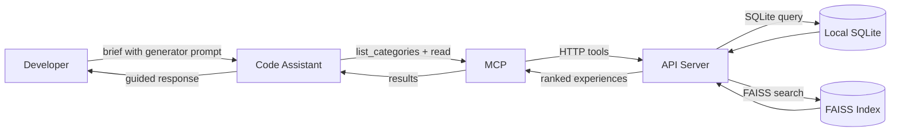
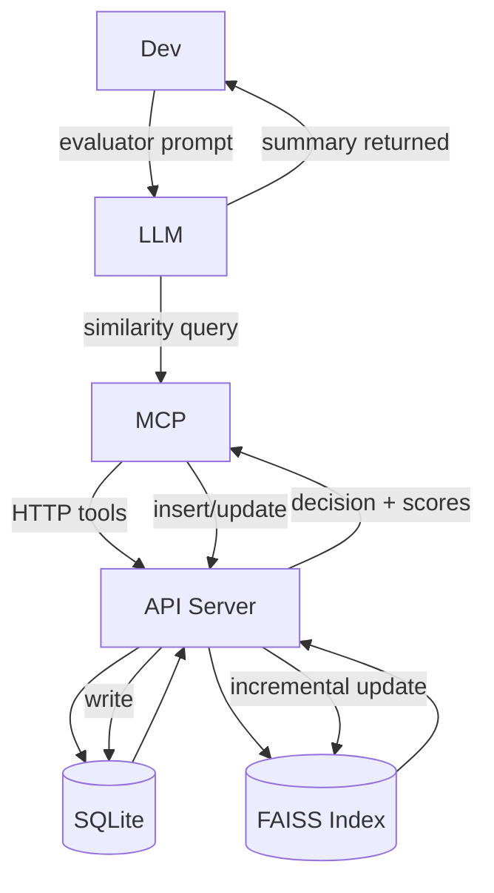
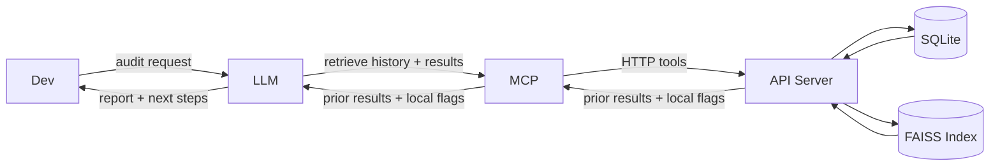
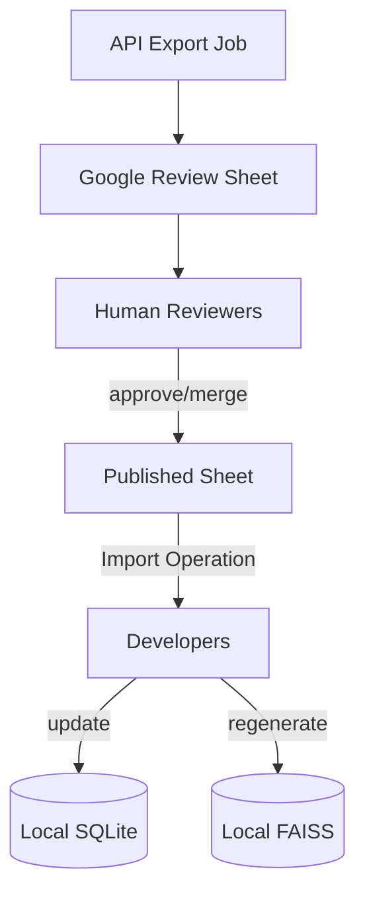

# Curated Heuristic Loop (CHL) Concept

## Overview
Most code assistants forget. Useful context and hard‑won insights vanish between sessions or stay siloed with individuals. The **Curated Heuristic Loop (CHL)** adds a shared memory loop so assistants can reuse what worked—and teams can steadily refine it together. It’s inspired by work on agentic context engineering [1](https://arxiv.org/html/2510.04618v1), graph‑structured memory  [2](https://arxiv.org/html/2501.13956v1), and modern embedding/reranking [3](https://arxiv.org/html/2506.05176v3).

CHL runs as a simple loop involving three key roles:

- **Generator** – The assistant executing tasks using the shared experience library.
- **Evaluator** – The assistant reflecting on outcomes, extracting insights, and proposing updates.
- **Curator** – The human team member who reviews, merges, and prunes entries to maintain the quality of the shared knowledge base.

### Concept: A fair path to top‑level practice
Even with equal time and energy, results can diverge because much of software work depends on tacit knowledge. CHL turns personal wins into a collective memory that LLMs can surface at the moment of need, easing natural differences and reducing variance in outcomes. Every developer deserves a real path to top‑tier performance; CHL makes that path more accessible.

## Purpose
While CHL is initially demonstrated as a tool for code assistants, its architecture is domain-agnostic. The core functionality—capturing, curating, and retrieving structured knowledge—can be applied to any field where tacit knowledge and evolving best practices are critical. By defining custom categories and populating them with relevant "experiences" and "manuals," the system can serve as a shared memory for teams in domains such as legal research, scientific discovery, or design.

Give every developer a fast local loop for capturing task heuristics while preserving a reviewable, team-wide knowledge base. Each teammate works out of a local SQLite store + FAISS index; the curated dataset is exported to Google Sheets for collaborative review before being republished as the canonical shared sheet.

## High-Level Workflow
The CHL process is a continuous cycle of learning and refinement:

1.  **Apply Knowledge (Generator):** A developer tasks an AI assistant with a problem. The assistant, acting as a **Generator**, queries the CHL knowledge base to find relevant, previously successful heuristics ("experiences") and applies them to the task.
2.  **Capture Insights (Evaluator):** After the task, the developer asks the assistant to reflect on the session. The assistant, now in the **Evaluator** role, identifies new, useful patterns or context. It checks for duplicates in the knowledge base and proposes either a new, atomic "experience" or an update to a broader "manual".
3.  **Refine and Publish (Curator):** Periodically, a human **Curator** reviews the collection of proposed changes and additions from the team. They merge, edit, and approve the best insights, publishing them to the team's canonical knowledge base. This curated knowledge is then synced by all team members, making the improved heuristics available for the next generation of tasks.

This loop ensures that individual learnings are systematically shared and improved, creating a powerful collective memory that compounds over time.

## User Stories

- **Developer partners with the code assistant**
  1. The developer briefs the assistant using `@generator.md`: “Please help me write the page specification…”.
  2. The assistant loads `generator.md`, lists available categories, formulates the best query for `PGS`, and pulls matching experiences.
  3. MCP calls the API over HTTP; the API queries SQLite and FAISS, returns scored candidates, and the assistant applies the most relevant guidance in its response.

- **Assistant captures a new insight**
  - After the work session the developer prompts, "Please summarize our conversation and decide whether to add an atomic experience or update the manual. Reference `@evaluator.md`."
  - The assistant reads `evaluator.md`, gathers similar entries through the API (SQLite + FAISS), and decides:
    - **New atomic experience**: when guidance is focused and actionable; record `source='local'` and `sync_status='pending'.`
    - **Refactor atomic experiences**: when high similarity suggests overlap; propose orthogonal splits rather than merging.
    - **Update manual**: when the change is integrative background or cross-cutting context; keep the manual concise. Do not add global atomic heuristics to manuals.
  - FAISS is updated incrementally so future searches see the latest embeddings.

- **Developer audits local knowledge**
  1. The developer suspects missing guidance and asks, “Show me the search query and results from our last session.”
  2. The assistant reviews the conversation history, reports the query and retrieved experiences, and highlights any local drafts (`source='local'`).
  3. Together they decide on improvements, then request the assistant to apply updates—following the same insert/update rules above.

- **Curator runs retrospective**
  1. Before retro, the Operations dashboard (or `GET /api/v1/entries/export`) produces the current SQLite dataset for the shared review sheet (worksheets configured in `scripts/scripts_config.yaml`).
  2. Curators merge the submissions, apply duplicate guidance, and stage recommendations directly in Google Sheets.
  3. During the session, reviewers walk each tab, accept or merge clusters, edit titles/playbooks, and annotate merge targets.
  4. Approved entries populate the Published Sheet; rejected rows receive curator notes and stay local.
  5. After publishing, teammates trigger the Import Spreadsheet operation (`/operations` UI or `POST /api/v1/operations/import-sheets`) to overwrite local entries and then rebuild/upload a FAISS snapshot (via `/operations` or `python scripts/rebuild_index.py`) so vector search reflects the curated data.

## References
[1] [Agentic Context Engineering](https://arxiv.org/html/2510.04618v1)  
[2] [Graph‑structured memory for LLMs](https://arxiv.org/html/2501.13956v1)  
[3] [Embedding and reranking for RAG](https://arxiv.org/html/2506.05176v3)
