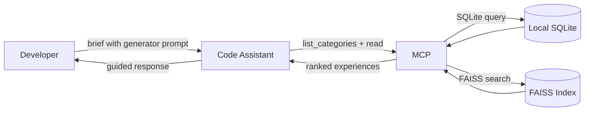
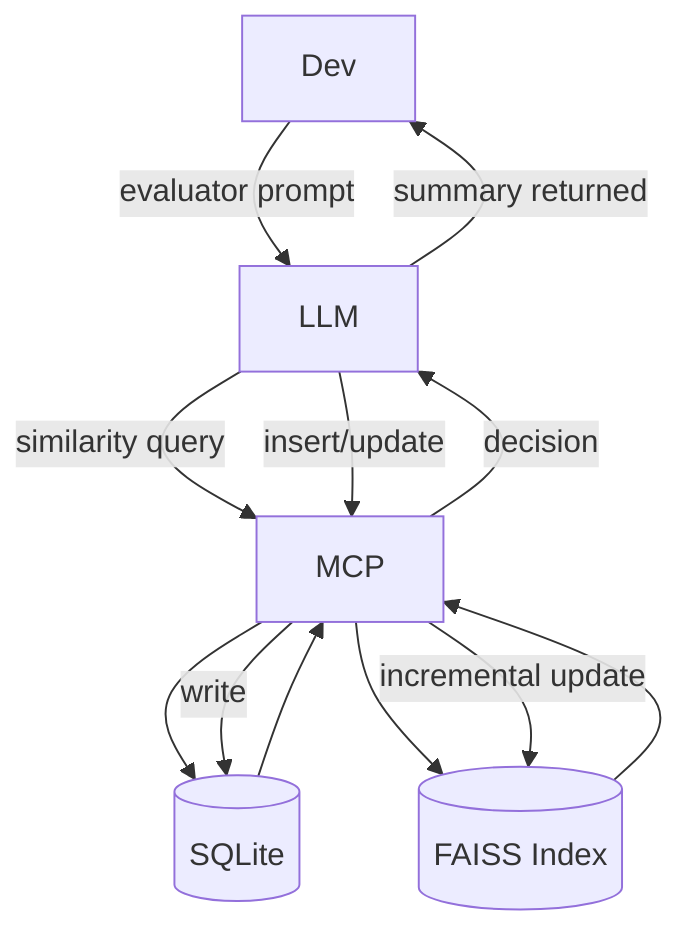
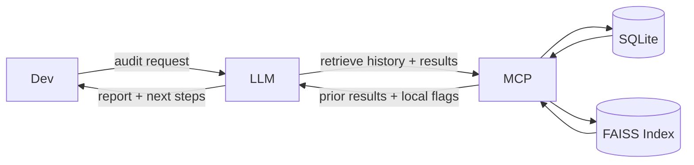
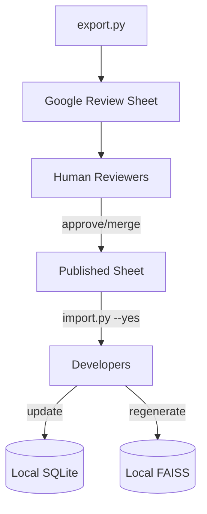

# Curated Heuristic Loop (CHL) Guide

## Overview
Most code assistants forget. Useful context and hard‑won insights vanish between sessions or stay siloed with individuals. The **Curated Heuristic Loop (CHL)** adds a shared memory loop so assistants can reuse what worked—and teams can steadily refine it together. It’s inspired by work on agentic context engineering [1](https://arxiv.org/html/2510.04618v1), graph‑structured memory  [2](https://arxiv.org/html/2501.13956v1), and modern embedding/reranking [3](https://arxiv.org/html/2506.05176v3).

CHL runs as a simple loop:
- **Generator** – executes tasks using the shared experience library.
- **Evaluator** – reflects on outcomes, extracts insights, and proposes updates.
- **Curator** – reviews accumulated entries, merges/prunes them, and republishes the playbook.

### Concept: A fair path to top‑level practice
Even with equal time and energy, results can diverge because much of software work depends on tacit knowledge. CHL turns personal wins into a collective memory that LLMs can surface at the moment of need, easing natural differences and reducing variance in outcomes. Every developer deserves a real path to top‑tier performance; CHL makes that path more accessible.

## Purpose
Give every developer a fast local loop for capturing task heuristics while preserving a reviewable, team-wide knowledge base. Each teammate works out of a local SQLite store + FAISS index; the curated dataset is exported to Google Sheets for collaborative review before being republished as the canonical shared sheet.

## Architecture
```
Developer + LLM (Generator / Evaluator prompts)
          ↓ MCP Protocol
   Local CHL Service (SQLite + FAISS)
          ↕ Operations Dashboard (manual FAISS refresh)
          ↓ export script
   Review Sheet (Google Sheets per category)
          ↓ curator merge + publish
   Published Sheet (reviewed Google Sheet)
          ↑ sync helper rebuilds local SQLite + FAISS
```

**Write Path**: Entries are written to SQLite immediately; operators rebuild/upload FAISS snapshots when convenient (often on a beefier box) to keep vectors fresh while preserving sub-100 ms write latency on every machine.

**Search Path**: FAISS vector search retrieves candidates, optional Qwen3 reranker scores them, then full records are fetched from SQLite.

See [User Stories](#user-stories) for a walkthrough of how Generator, Evaluator, and Curator collaborate in this architecture.

## Data Surfaces
- **Local SQLite** – authoritative per-user store with `experiences` (atomic patterns), `category_manuals` (long-form context), `embeddings`, and change tracking (`source`, `sync_status`, timestamps). Every write flows here first.
- **Local FAISS** – incrementally updated vector index keyed by `experience_id` and `manual_id`. Vector search is the default retrieval path; `scripts/setup.py` provisions the embedding and reranker models required to keep the index in sync with SQLite.
- **Review Sheet** – generated export (Google Sheet) containing newly added or modified experiences and manuals (`source='local'` or `sync_status='pending'`). Curators merge these submissions, resolve conflicts, and stage the updates.
- **Published Sheet** – the reviewed Google Sheet (often the same document with a dedicated "Published" tab or version). Developers sync from this sheet—or an individual merged copy—to rebuild local SQLite + FAISS.

## End-to-End Workflow
1. **Capture** – MCP `write_*` writes to SQLite immediately with `embedding_status='pending'`. Before committing, the assistant retrieves semantic matches (FAISS → optional Qwen3 reranker scoring) to guide the write:
   - For **atomic experiences**: do not auto-update/merge global entries on high similarity. Prefer adding a new atomic entry or proposing a refactor to keep experiences orthogonal; surface near-duplicates to curators.
   - For **category manuals**: updates are allowed when the change is integrative background or cross-cutting context. Keep manuals concise; if the intended change is a global atomic heuristic, do not add it to the manual—create an experience instead.
   Nearby matches may be surfaced to curators during review; no relationship graph is stored in current phases.
2. **Vector Refresh** – CHL keeps write latency low by recording entries with `embedding_status='pending'` and defers vector generation to an operator workflow. Use the web Operations dashboard (FAISS Snapshot card) or `scripts/rebuild_index.py` on a machine with the ML extras to rebuild/upload the index whenever new content ships.
3. **Index Maintenance** – Each snapshot replaces the `.index/.meta/.backup` set under `CHL_FAISS_INDEX_PATH` and updates FAISS metadata. The operations service logs who initiated the swap plus the last-run timestamps so curators can see when vectors were refreshed after imports or model changes.
4. **Export for Review** – a periodic job extracts rows where `source='local'` or `sync_status='pending'` and writes them to a locked-schema Google Sheet (category-scoped tabs). Export does not change `sync_status`; entries remain `pending` until the curated set is imported. If you ever deploy a separate worker pool, the export script can still call the pause/drain/resume endpoints, but by default those calls simply no-op.
5. **Curate** – reviewers inspect clusters, merge/supersede where appropriate, adjust playbooks, and enrich metadata directly in the review sheet (or a curator UI backed by SQLite).
6. **Publish** – curators apply the approved entries to the Published Sheet (versioned Google Sheet). Rows imported from the sheet inherit `source='global'`; timestamps capture provenance.
7. **Distribute** – teammates run the import script (`python scripts/import.py …`) to pull from the Published Sheet—or a curated merged sheet—rebuild local SQLite, refresh FAISS, and keep personal additions intact. Worker coordination (pause → drain → import → resume) happens automatically if the API server is running.

## MCP Interface Strategy
- **Reads** – retrieve candidates via FAISS (vector), optionally rerank with the Qwen3 reranker, then fetch full records from SQLite by ID. Responses include `source` metadata so clients can distinguish global vs personal entries.
- **Writes** – persist to SQLite immediately with `embedding_status='pending'`; return success. Vector refresh now happens explicitly via the Operations dashboard (FAISS snapshot upload/rebuild) or maintenance scripts such as `rebuild_index.py`. MCP never writes directly to review or published sheets.
- **Dedup & Decision Hints** – every write returns top-k matches with scores, sections, and source flags, plus guidance on whether to: (a) add a new atomic experience, (b) refactor an existing atomic experience, or (c) update a category manual (for integrative, non-atomic context). Keep manuals concise—do not add global atomic heuristics to manuals.
- **Review Hooks** – optionally expose an MCP tool to request a change to a global entry; the server marks `sync_status='pending'` and records a curator-facing note.

## Experience vs Manual Decision
- Prefer an **atomic experience** when the guidance is actionable, narrow, and testable on its own. If a match is highly similar, propose refactoring both entries to keep them orthogonal; avoid merging into a broad catch-all.
- Prefer a **manual update** when the change is integrative background, architecture rationale, or synthesis across multiple experiences. Keep the manual concise to preserve embedding/search quality.
- If a proposed manual change is actually a global atomic heuristic, do not add it to the manual—capture it as an experience instead.
- Evaluator prompts should explicitly make this decision, citing the reason (atomic vs. integrative) so curators can audit later.

## Handling SQLite + FAISS + Sheets
- SQLite is the single truth for local work; FAISS is a performance layer updated whenever an operator uploads/rebuilds the snapshot from the Operations dashboard or maintenance scripts.
- Entries are written to SQLite with `embedding_status='pending'`; operators decide when to regenerate embeddings (e.g., nightly on a beefy host) and upload the resulting FAISS snapshot. This keeps write latency low without requiring background workers on every machine.
- Sheets exist only for human review/export. The export script enforces column order, locks headers, and carries provenance (`author`, `source`) so curators know origin. Worker coordination (pause → drain → import/export → resume) ensures consistency during bulk operations.
- The merge pipeline can ingest the last published sheet, fresh exports, and reviewer edits to produce the next published tab. Vector similarity assists clustering, but the final decision sits with humans.
- Each FAISS vector stores the `last_synced_at` timestamp; during sync, outdated vectors are replaced, and stale local edits trigger merge prompts.
- The `sync_status` flag tracks whether entries are already published, pending curator review, or kept local for personal use. The `embedding_status` flag (`pending`, `embedded`, `failed`) tracks async processing state.

## Review & Governance
- Provision database schema via the setup script (tables are created idempotently using SQLAlchemy metadata).
- Provide a controlled vocabulary for categories, sections, statuses, and tags in a reference table that both the MCP and review sheet use.
- Record curator actions (accepted, superseded, retired) in the Published Sheet; surface them as signals for assistants deciding whether to update or add.
- Run periodic analytics (e.g., top duplicate clusters, unused entries) to guide pruning.
- Keep `generator.md` and `evaluator.md` as the canonical prompt templates so assistants follow the same capture and reflection flows across tasks.

## Category Index

- Keep the category list focused on PHP web application work. Suggested starter shelves:
  - `figma_page_design` (`FPD`)
  - `database_schema_design` (`DSD`)
  - `page_specification` (`PGS`)
  - `ticket_management` (`TMG`)
  - `architecture_design` (`ADG`)
  - `migration_code` (`MGC`)
  - `frontend_html` (`FTH`)
  - `laravel_php_web` (`LPW`)
  - `python_agent`(`PGT`)
  - `playwright_page_test` (`PPT`)
  - `e2e_test` (`EET`)
  - `pull_request` (`PRQ`)

Categories remain dynamic: the MCP server enumerates configured categories at startup (now via SQLite metadata) and exposes them through `list_categories`. Each entry stores the authoritative `category_code`, so filenames or sheet tabs can stay human-readable.

## MCP Interaction Flow
1. **Startup** – the MCP service loads configuration, hydrates SQLite, builds (or verifies) the FAISS index, and advertises the available categories along with the prompt conventions (`generator.md`, `evaluator.md`).
2. **Generator Mode** – the assistant selects the most relevant category, queries SQLite, reranks with FAISS, and applies only the top experiences to the active task.
3. **Evaluator Mode** – upon user request, the assistant summarizes outcomes, evaluates similarity, and either updates an existing entry or appends a new local insight. The MCP records provenance and marks rows as pending for export.
4. **Logging** – capture gray areas by creating a pending atomic experience or a concise manual update (whichever fits). No separate discrepancy log is used; curators review pending entries during export/sync.
5. **Retro Export** – run `uv run python scripts/export.py` to snapshot the local SQLite dataset into the shared review sheet for curation.
6. **Publish & Sync** – curators finalize the Published Sheet; developers run `uv run python scripts/import.py --yes` and then rebuild/upload a FAISS snapshot via `/operations` (or `uv run python scripts/rebuild_index.py`) before continuing the loop.

## User Stories

- **Developer partners with the code assistant**
  1. The developer briefs the assistant using `@generator.md`: “Please help me write the page specification…”.
  2. The assistant loads `generator.md`, lists available categories, formulates the best query for `PGS`, and pulls matching experiences.
  3. MCP queries SQLite + FAISS, returns scored candidates, and the assistant applies the most relevant guidance in its response.


- **Assistant captures a new insight**
  - After the work session the developer prompts, "Please summarize our conversation and decide whether to add an atomic experience or update the manual. Reference `@evaluator.md`."
  - The assistant reads `evaluator.md`, gathers similar entries via SQLite + FAISS, and decides:
    - **New atomic experience**: when guidance is focused and actionable; record `source='local'` and `sync_status='pending'.`
    - **Refactor atomic experiences**: when high similarity suggests overlap; propose orthogonal splits rather than merging.
    - **Update manual**: when the change is integrative background or cross-cutting context; keep the manual concise. Do not add global atomic heuristics to manuals.
  - FAISS is updated incrementally so future searches see the latest embeddings.



- **Developer audits local knowledge**
  1. The developer suspects missing guidance and asks, “Show me the search query and results from our last session.”
  2. The assistant reviews the conversation history, reports the query and retrieved experiences, and highlights any local drafts (`source='local'`).
  3. Together they decide on improvements, then request the assistant to apply updates—following the same insert/update rules above.


- **Curator runs retrospective**
  1. Before retro, `uv run python scripts/export.py` writes the current SQLite dataset to the shared review sheet (worksheets configured in `scripts/scripts_config.yaml`).
  2. Curators merge the submissions, apply duplicate guidance, and stage recommendations directly in Google Sheets.
  3. During the session, reviewers walk each tab, accept or merge clusters, edit titles/playbooks, and annotate merge targets.
  4. Approved entries populate the Published Sheet; rejected rows receive curator notes and stay local.
  5. After publishing, teammates run `uv run python scripts/import.py --yes` to overwrite local entries and then rebuild/upload a FAISS snapshot (via `/operations` or `uv run python scripts/rebuild_index.py`) so vector search reflects the curated data.


## Web UI for Operators

Phases 0–3 of the web initiative add a localhost-only UI (served by FastAPI) so non-CLI users can run CHL safely. The `/settings` page now begins with a first-time checklist so the README can simply say “start the server and follow the page.”

- **Settings Dashboard** (`/settings`)
  - Guides credential placement with two flows: upload the JSON into the managed `credentials/` directory or point to an existing path. Only the path, checksum, and validation timestamp are stored in SQLite.
  - Includes forms for Google Sheet tabs, preferred embedding/reranker models, and a diagnostics panel that re-validates API connectivity.
  - Offers JSON backup/restore of non-secret metadata plus a rolling audit log view so configuration changes are traceable.

- **Operations Dashboard** (`/operations`)
  - Provides import/export/index triggers with advisory locks plus live queue/job telemetry via SSE + htmx every ~5 seconds. Worker controls stay hidden until an external pool registers, so the default path emphasizes manual FAISS snapshots.
  - Surfaces last-run metadata per job type (actor, timestamp, duration) so you know what ran recently without opening SQLite.
  - Adds FAISS snapshot tooling: download the current `.index/.meta` artifacts as a ZIP or upload a snapshot that stays on disk, logs an audit entry, and attempts an in-process reload. Uploads never touch SQLite.

The UI binds to `127.0.0.1` by default; if you proxy it elsewhere you must layer your own auth. These pages deliberately share the same FastAPI process as the MCP/API stack so every action routes through the audited services introduced in Phase 0.
