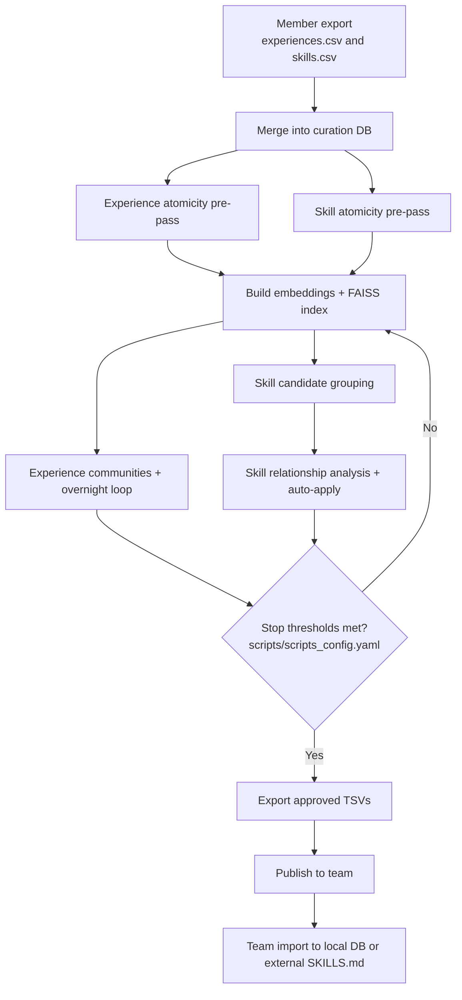

# Curation Spec

## Flow Diagram



## Architecture

### Entrypoints

**Typical curation workflow (run in this order):**

1. **`merge_all.py`** - Data preparation and initial merge
   ```bash
   python scripts/curation/common/merge_all.py
   ```
   - Imports/merges experiences from main database to curation database
   - Prepares data for LLM-based curation
   - Run this FIRST before overnight curation

2. **`overnight_all.py`** - Automated overnight curation
   ```bash
   python scripts/curation/common/overnight_all.py
   ```
   - Runs multi-round LLM-based curation for both experiences and skills
   - Uses LLM to decide merge/keep decisions
   - Automatically applies decisions and rebuilds communities
   - Use `--no-skills` to skip skill curation
   - Run this AFTER merge_all to curate the prepared data

### Defaults and config
- Defaults are read from:
  - `scripts/scripts_config.yaml`
  - `scripts/curation/agents/prompts/curation_prompt.yaml`
- **Database usage**:
  - `data/chl.db` - Main database for MCP operations (read/write entries, search, daily usage)
  - `data/curation/chl_curation.db` - Curation database for overnight curation workflow
  - `data/curation/.curation_state_loop.json` - Curation state tracking

### Core loop (high level)
1) Auto-dedup high-confidence pairs (>= `auto_dedup` threshold).
2) LLM decides per community: `merge_all`, `merge_subset`, `keep_separate`, `manual_review` (human curator review).
3) Apply decisions → rebuild communities (no FAISS re-query).
4) Stop when progress is low or max rounds reached.

### Community building
Why: Communities group nearby experiences so the LLM reviews related items together instead of scanning the whole dataset. Groups are separated by category to reduce candidate volume and review load.

How: Build a sparse similarity graph from top‑K embedding neighbors, then run community detection (Louvain or Leiden) per category; results are cached in `communities.json`.
Pros/cons:
- Embeddings: fast, scalable, good for broad semantic grouping; weaker at fine‑grained distinctions.
- Rerank: improves precision on close candidates; higher cost and slower at scale.

Rerank (`--with-rerank`):
- Use rerank when embedding neighbors feel too noisy or semantically weak.
- Rerank changes neighbor scores before communities are formed; it does not rerun during the overnight loop.

Algorithm choice:
- Default: **[Louvain method](https://en.wikipedia.org/wiki/Louvain_method)** (`curation.algorithm: louvain` in `scripts/scripts_config.yaml`).
- Switch to **[Leiden algorithm](https://en.wikipedia.org/wiki/Leiden_algorithm)** by setting `curation.algorithm: leiden` or by passing `--algorithm leiden` to `scripts/curation/experience/merge/build_communities.py`.

### Curation
The curation loop uses LLMs at a few targeted points:
- **Normalization**: assign missing skill categories (LLM category mapping) and generate outlines when needed.
- **Atomicity**: verify skills/experiences are single‑purpose; split if they are not.
For experiences:
  - The atomicity pre-pass reviews the full experience content (title/playbook/context) and splits only when multiple distinct experiences are bundled together.
  - The LLM returns `atomic` vs `split` (no numeric threshold), and split items are re‑outlined before the community loop.
For skills:
  - The atomicity pre-pass uses the skill outline (from `metadata["chl.outline"]`) plus full content in the prompt.
  - There is no numeric threshold; the LLM decides `atomic` vs `split` directly.
  - If an outline is missing, it should be generated earlier during import/normalization.
- **Merge decisions**: decide relationships (merge/keep/split/flag) and generate merged content when needed.
- **Iteration**: rebuild communities and repeat until the stop thresholds in `scripts/scripts_config.yaml` are met.

Carlos can tune thresholds and behavior in `scripts/scripts_config.yaml` to fit team needs.

LLM choice:
- Use a cost‑effective model (e.g., Gemini Flash or local ChatGPT OSS) for curation.
- Expensive commercial LLMs are usually over‑spec for this task.

### Outputs
- `data/curation/morning_report.md`
- `data/curation/evaluation_log.csv`
- `data/curation/communities.json`

## Telemetry and Audit Systems

CHL includes built-in telemetry and audit logging to help operators monitor curation workflows and troubleshoot issues.

### Audit Log

**Purpose:** Track all database operations (create, update, delete) for accountability and debugging.

**Storage:** `audit_log` table in both `data/chl.db` (main) and `data/curation/chl_curation.db` (curation)

**What's logged:**
- **Event type**: free-form event string (e.g., operations.* or settings.*)
- **Actor**: optional actor/user string
- **Context**: optional JSON/text payload describing the event
- **Timestamp**: `created_at`

**Accessing audit logs:**
- Via Settings dashboard: `http://localhost:8000/settings` → Audit Log section
- Directly in SQLite: `SELECT * FROM audit_log ORDER BY created_at DESC LIMIT 100;`
- Note: there is no public REST endpoint for audit logs; entries are written by API services and operations handlers.

**Use cases:**
- Track when experiences were merged during curation
- Debug unexpected deletions or updates
- Review curation decisions history
- Accountability for team workflows

### Telemetry

**Purpose:** Monitor queue depth, worker status, and system health for GPU modes.

**Storage:** `telemetry_samples` and `worker_metrics` tables

**What's tracked:**
- **Queue depth**: Number of pending embedding jobs (experiences/skills waiting for vector generation)
- **Worker status**: Active/idle status, jobs processed, failures
- **Processing rates**: Jobs per second, average processing time
- **Resource usage**: GPU memory utilization (when available)

**Accessing telemetry:**
- Via API: `GET /api/v1/telemetry/snapshot`
- Via SSE stream: `/ui/stream/telemetry`
- Via Operations dashboard: `http://localhost:8000/operations` → Queue Status section
- Direct database query: `SELECT * FROM telemetry_samples ORDER BY recorded_at DESC LIMIT 100;`

**Use cases:**
- Monitor embedding queue during large imports
- Identify bottlenecks (e.g., slow GPU processing)
- Verify background workers are processing jobs
- Troubleshoot stalled operations

**Note:** Telemetry is primarily useful in GPU mode where embedding generation can take time. CPU mode has no embedding workers, so telemetry will show empty queues.

## QA

### Why do we need team curation?

**A:** It keeps the shared knowledge base consistent and non-duplicative across members, so everyone imports the same validated skills/experiences and avoids drift or conflicting guidance. As skills and experiences accumulate, team efficiency increases because sharing with AI is a simple copy/paste import rather than a slow human handoff.

### Is it possible to skip the atomicity pre-pass if I am sure the experiences and skills are already atomic?

**A:** Yes. Run the overnight command with `--skip-atomicity-pre-pass` to skip atomicity for both experiences and skills:
```bash
python scripts/curation/common/overnight_all.py --skip-atomicity-pre-pass
```
